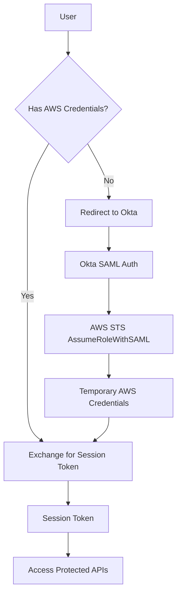

# Authentication Guide

This application supports multiple authentication methods for flexibility across different AWS environments.

## Overview

The application can work with:
- Okta SAML authentication
- AWS SSO (IAM Identity Center)
- Generic SAML providers
- Local AWS CLI credentials (development only)

## Authentication Methods

### 1. Okta SAML Authentication

Configure in `.env`:
```env
OKTA_SAML_APP_URL=https://dev-xxxxx.okta.com/app/amazon_aws/exkxxxxx/sso/saml
OKTA_SAML_ROLE_ARN=arn:aws:iam::123456789012:role/YourOktaSAMLRole
OKTA_SAML_PROVIDER_ARN=arn:aws:iam::123456789012:saml-provider/OktaSAMLProvider
```

Users click "Sign in with Okta" and are redirected to your existing Okta SAML app.

### 2. AWS SSO (IAM Identity Center)

Configure in `.env`:
```env
AWS_SSO_START_URL=https://your-sso-portal.awsapps.com/start
AWS_SSO_REGION=us-east-1
AWS_SSO_ACCOUNT_ID=123456789012
AWS_SSO_ROLE_NAME=YourSSORole
```

Users authenticate via AWS CLI (`aws sso login`) then exchange credentials.

### 3. Generic SAML Provider

Configure in `.env`:
```env
SAML_APP_URL=https://your-idp.com/saml/sso
SAML_ROLE_ARN=arn:aws:iam::123456789012:role/YourSAMLRole
SAML_PROVIDER_ARN=arn:aws:iam::123456789012:saml-provider/YourSAMLProvider
```

### 4. Credential Exchange

If users have already authenticated via:
- AWS Console with Okta SAML
- AWS CLI with `saml2aws` or similar tools
- Any other method that provides temporary AWS credentials

They can exchange these credentials for a session token:

```bash
curl -X POST http://localhost:4000/auth/exchange \
  -H "Content-Type: application/json" \
  -d '{
    "accessKeyId": "ASIA...",
    "secretAccessKey": "...",
    "sessionToken": "..."
  }'
```

### 3. Environment-Based Authentication (Development)

For local development, if you have AWS credentials in your environment (via AWS CLI, `saml2aws`, etc.), the application can use them directly.

## Authentication Flow



## Session Management

- Sessions are managed via signed JWT-like tokens
- Tokens expire after 1 hour by default
- In production, tokens are stored in secure HTTP-only cookies
- In development, tokens can be passed via Authorization header

## API Authentication

All API endpoints under `/api/*` require authentication. Include the session token in requests:

### Cookie-based (Production)
```bash
curl http://api.example.com/api/dashboards \
  -H "Cookie: session=<token>"
```

### Header-based (Development)
```bash
curl http://localhost:4000/api/dashboards \
  -H "Authorization: Bearer <token>"
```

## Security Considerations

1. **No Credentials Storage**: The application never stores AWS credentials
2. **Temporary Credentials Only**: All operations use temporary STS credentials
3. **Session Isolation**: Each session has its own credentials
4. **HTTPS Only**: In production, all authentication flows require HTTPS
5. **SAML Validation**: SAML assertions are validated by AWS STS

## Troubleshooting

### "No session token" error
- Ensure you've authenticated via `/auth/saml` or `/auth/exchange`
- Check if your session has expired (1 hour default)

### "Invalid SAML response" error
- Verify your Okta SAML app is configured correctly
- Check that the SAML role ARN and provider ARN are correct in `.env`

### "Authentication failed" error
- Check CloudWatch logs for the Lambda function (in production)
- Verify IAM role has necessary permissions
- Ensure SAML provider trust relationship is configured correctly